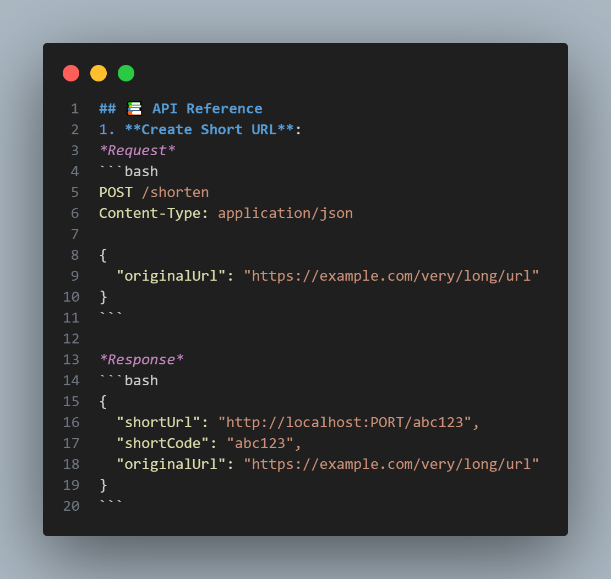

# 🔗 URL Shortener Service

> Developed by **Ahmed Medhat**

<div align="center">
  
</div>

---
## 📋 Project Overview
A professional **URL shortener** built with **Node.js, Express, MySQL, and Sequelize**. Users can shorten URLs, get redirected, and view click analytics including referrer breakdown.

## Features
- Generate short, unique URLs.
- Redirect to original URL while tracking each click.
- Analytics endpoint to view total clicks and referrer sources.
- Clean, modular code with unit tests.

---
### Node.js Project Architecture
```js
url-shortener-service/
├── config/
│   └── database.js
├── controllers/
│   └── urlController.js
├── models/
│   ├── click.js
│   ├── index.js
│   └── url.js
├── routes/
│   └── urlRoutes.route.js
├── node_modules/
├── public/
│   └── code.png
├── tests/
│   ├── controllers/
│   │   └── urlController.test.js
│   └── validations/
│       └── urlServices.test.js
├── .env
├── .gitignore
├── app.js
├── package-lock.json
├── package.json
└── README.md
```

---
## 🛠️ Technology Stack
| Technology                                                                                                                | Purpose                           | Version |
| ------------------------------------------------------------------------------------------------------------------------- | --------------------------------- | ------- |
|                 | JavaScript Runtime Environment    | 18.x+   |
|            | Web Application Framework         | 5.x     |
|                        | Relational Database               | 8.x     |
|            | ORM for Database Modeling         | 6.x     |
|                       | MySQL Database Driver             | 3.x     |
|                      | Environment Variables Loader      | 16.x    |
|                           | Testing Framework                 | 29.x    |
|                | HTTP Assertion Library            | 7.x     |
|                  | Development Auto-restart Tool     | 3.x     |

## Installation
1. **Clone the repository**:
```bash
  git clone https://github.com/yourusername/url-shortener-service.git
  cd url-shortener-service
```

2. **Install dependencies**:
```bash
npm install
```

3. **Create MySQL database**:
```sql
  CREATE DATABASE IF NOT EXISTS url_shortener;
```

4. **Configure environment variables**:
```js
PORT=

DB_HOST=localhost
DB_USER=
DB_PASSWORD=
DB_NAME=url_shortener
DB_PORT=
```

5. **Start the server**:
```bash
npm start
```

---
## 📄 License
**PROPRIETARY LICENSE**
© 2026 - Ahmed Medhat. All Rights Reserved.
This project is a personal, non-commercial work created solely for the purpose of demonstrating full-stack web development skills.

## 👥 Author
* **Ahmed Medhat** – Junior Backend Engineer